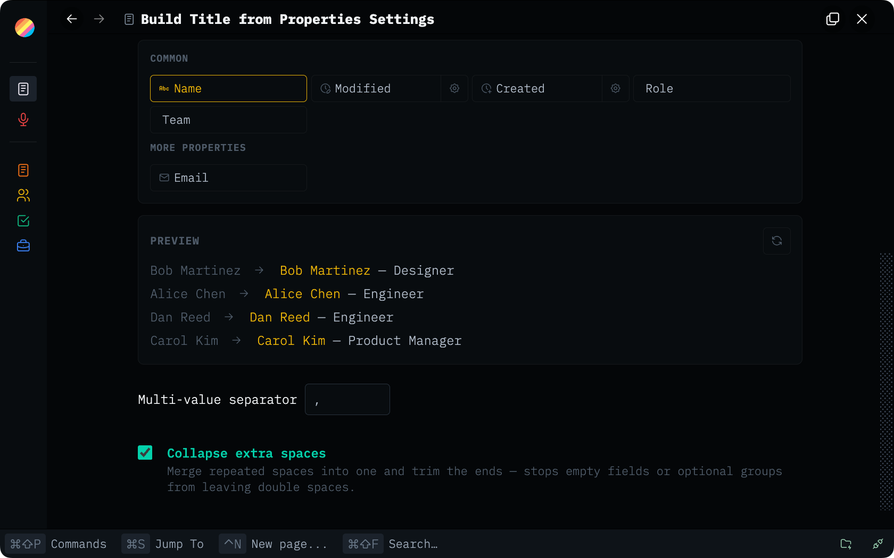

# Build Title from Properties

Global Thymer plugin that manages per-collection title builders.

Plugins are made with 🤍 for the Thymer community. Free to use, fork, and hack on for <a href="LICENSE" target="_blank" rel="noopener noreferrer">non-commercial use</a>.

Plug-ins take effort, hours, and credits to build. If you find them helpful for you and your workflows, a star ⭐ on the repo, a <a href="https://buymeacoffee.com/akaready" target="_blank" rel="noopener noreferrer">coffee</a> ☕, and a link back to <a href="https://akaready.com" target="_blank" rel="noopener noreferrer">@akaready</a> 🔗 all go a long way. Optional of course, but always appreciated.

Enjoy! 🙏

  

&nbsp;

## 📦 Install

**Recommended:** Use the <a href="https://github.com/ahpatel/thymer-plugins-manager" target="_blank" rel="noopener noreferrer">Thymer Plugins Manager</a> and install via <a href="https://github.com/akaready/thymer-build-title-from-properties" target="_blank" rel="noopener noreferrer">this repo's URL</a>. You'll get notifications when new versions ship.

**Manual:** copy <a href="plugin.js" target="_blank" rel="noopener noreferrer"><code>plugin.js</code></a> and <a href="plugin.json" target="_blank" rel="noopener noreferrer"><code>plugin.json</code></a> from this repo into Thymer's plugin editor.

&nbsp;

## ✨ What It Does

- Adds one settings panel for all collections.
- Reads each collection's properties from the SDK and lets the user build a title
  template in a GUI.
- Installs a small managed collection-side hook when requested.
- The collection-side hook uses Thymer's native `customizeRecordTitle()` API, so
  record names are display-only and reversible.

&nbsp;

## ⚙️ How It Works

This is an `AppPlugin`. It cannot directly call collection-only APIs such as
`customizeRecordTitle()` for every collection, so it acts as a manager:

- blank or already-managed collections can be installed/updated automatically;
- collections with unrelated custom code are marked as needing review and are not
  overwritten;
- per-collection settings live in `plugin.json` at `custom.buildTitle`.

Supported template syntax:

- `{name}` inserts the record's normal editable name.
- `{field:FIELD_ID}` inserts a property value.
- `?{ ... }` optional groups render only when at least one field inside has a value.
- `\{` and `\}` escape literal braces.

Only `{name}` corresponds to the record name users should edit in Thymer's editor.
Property tokens are display-only title parts; edit the source properties in their
normal property fields.

Example: `?{- {field:title}}` renders `- Sailor` when `title` has a value and
renders nothing when it is blank.

&nbsp;

## 📊 Anonymous Usage Counter

This plugin pings a <a href="https://www.goatcounter.com/" target="_blank" rel="noopener noreferrer">privacy-respecting counter</a> on first install and once per day of active use. It exists so I can see which plugins are worth continuing to invest in — both "did anyone install it" and "is anyone still using it after a week." Combined with the coffee donations, this is what tells me whether to keep building. It tracks the plugin slug only, no other telemetry or user data, and you can see exactly what I see on the <a href="https://thymer-plugins.goatcounter.com" target="_blank" rel="noopener noreferrer">public dashboard</a>.

**Opt out:** Do Not Track, or `localStorage.setItem('tps-telemetry-opt-out','1')` in the console.
